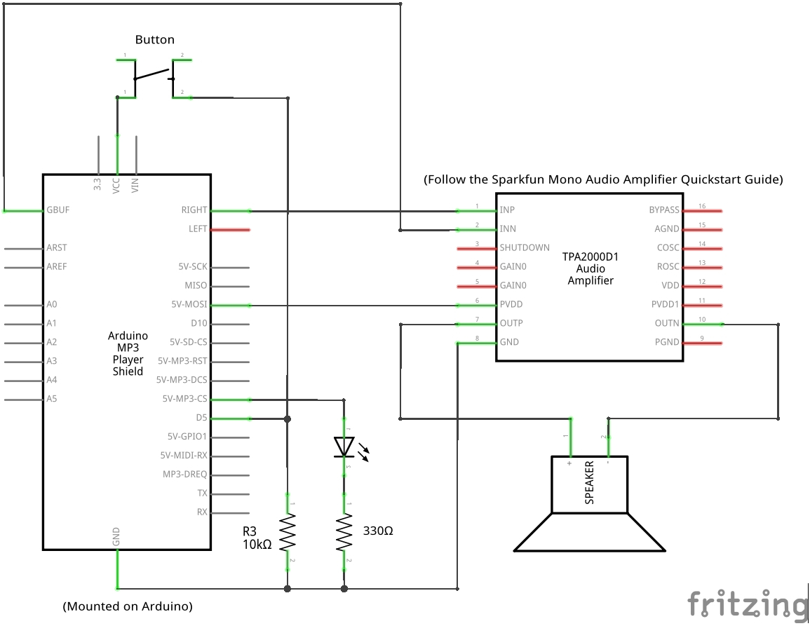

# Duckveloper 🐤

Say goodbye to the low-tech days of rubber duck debugging! **Duckveloper 🐤** is the coding partner you never knew you needed.

Simply press a button and the innovative, high-tech duck will generously provide you with words of "encouragement" to help you figure out what's really wrong with your code.

Arduino project with an MP3 shield, speaker, and rubber duck. Inspired by the strategy of [rubber duck debugging](https://en.wikipedia.org/wiki/Rubber_duck_debugging).

## Components

This project uses the [Arduino VS1053 Library](https://github.com/mpflaga/Arduino_Library-vs1053_for_SdFat) to decode MP3 audio and interface with the MP3 shield.

Serial | Name | Quantity | Description
--- | --- | --- | ---
| | Rubber Duck | As many as you need to be happy in life
DEV-11021 | [Arduino Uno - R3](https://www.sparkfun.com/products/11021) | 1
DEV-12660 | [SparkFun MP3 Player Shield](https://www.sparkfun.com/products/12660) | 1 | Requires soldering on headers
PRT-11417 | [Arduino Stackable Header Kit - R3](https://www.sparkfun.com/products/11417) | 1 | For the MP3 Shield
BOB-11044 | [SparkFun Mono Audio Amp Breakout - TPA2005D1](https://www.sparkfun.com/products/11044) | 1
COM-09151 | [Speaker (0.5W)](https://www.sparkfun.com/products/9151) | 1
PRT-10512 | Optional: [9V Battery Holder](https://www.sparkfun.com/products/10512) | 1

Other common generic components you should have:
* 1 button/switch (e.g. [Momentary Pushbutton Switch](https://www.sparkfun.com/products/9190))
* 1 LED (e.g. [Super Bright LED](https://www.sparkfun.com/products/11118))
* 1 breadboard
* Resistors (1 x 330 Ω, 1 x 10k Ω)
* Wires

## Setup

### Hardware Configuration

Solder the stackable headers onto the MP3 Player shield.

Mount the MP3 Player shield onto the Arduino Uno.

Connect the remaining components according to the following schematic:

To accurately connect the Audio Breakout Board (TPA2005D1), follow the [SparkFun Mono Audio Amplifier Quickstart Guide](https://www.sparkfun.com/tutorials/392).

### SD Card Setup

Format the SD card to FAT16 or FAT32.

Place your intended voicelines onto the SD card, named in the format of `track001.mp3`, `track002.mp3`, etc.

Install the SD card into the MP3 Player Shield.

### Software Configuration

[Download the Arduino IDE](https://www.arduino.cc/en/software).

[Install the VS1053 library in the Arduino IDE](https://mpflaga.github.io/Arduino_Library-vs1053_for_SdFat/).

Open, compile, and upload the `duckveloper/duckveloper.ino` program to the Arduino.

### Operating the Project

Press the button to trigger one of the random voicelines as well as the LED.

To monitor the program's output, open the serial monitor and set the baud rate to 115200.

## Reference

For more information on working with the components in this project, see:
* [SparkFun MP3 Player Shield Hookup Guide](https://learn.sparkfun.com/tutorials/mp3-player-shield-hookup-guide-v15/all)
* [SparkFun Mono Audio Amplifier Quickstart Guide](https://www.sparkfun.com/tutorials/392)